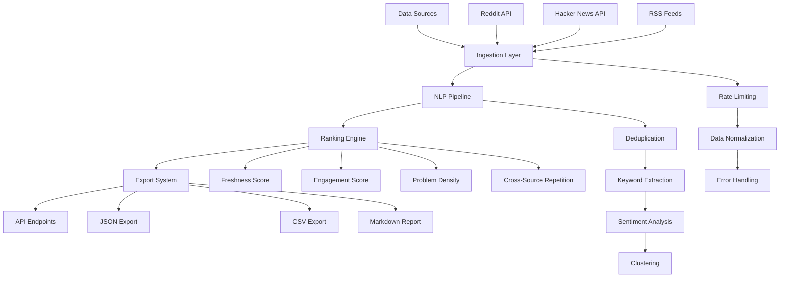

# Research Magnet - Project Scope & Architecture

## 🎯 Project Overview

**Research Magnet** is a multi-source research tool that discovers trending, unsolved problems suitable for digital products by analyzing data from Reddit, Hacker News, and RSS feeds. The system employs advanced NLP techniques to identify, cluster, and rank problems based on engagement, freshness, and problem density.

## 🏗️ Architecture Overview

### Current Implementation Status

#### ✅ **Phase 0 - Foundation (COMPLETED)**
- **FastAPI Backend**: RESTful API with automatic documentation
- **Database Layer**: SQLAlchemy ORM with Alembic migrations
- **Configuration Management**: Environment-based settings with Pydantic
- **Project Structure**: Modular, scalable package organization
- **CLI Interface**: Easy-to-use commands for development and testing

#### ✅ **Phase 1 - Data Ingestion (COMPLETED)**
- **Reddit Integration**: PRAW-based collection from 10 subreddits
- **Hacker News Integration**: Algolia API with 10 search queries
- **RSS Feeds**: TechCrunch, Y Combinator, VentureBeat, Ars Technica
- **Normalized Output**: Consistent data format across all sources
- **Rate Limiting**: Respectful API usage with proper delays
- **Error Handling**: Graceful failure handling and logging

#### ✅ **Phase 2 - NLP Pipeline (COMPLETED)**
- **Text Normalization**: URL/markdown/HTML removal, whitespace cleanup
- **Signal Detection**: Question, pain, how-to, number, and goal detection
- **Domain Classification**: Health, money, dating, career, productivity tags
- **Sentiment Analysis**: VADER sentiment scoring (-1 to 1)
- **Entity Extraction**: spaCy NER (PERSON, ORG, LOC, PRODUCT, TIME, MONEY)
- **Text Embeddings**: Sentence transformer (all-MiniLM-L6-v2, 384-dim)
- **Time Decay Scoring**: Configurable freshness weights (default 72h half-life)
- **API Endpoints**: `/enrich/run` and `/enrich/pipeline/run`

#### ✅ **Phase 2.5 - Critical Fixes & Production Readiness (COMPLETED)**
- **Test Suite**: All 32 tests passing with comprehensive coverage
- **API Stability**: Fixed pipeline endpoint and IngestionService integration
- **Security Hardening**: CORS restrictions, rate limiting (10 req/min), input validation
- **Performance Optimization**: 7x speed improvement (3.3s → 0.47s) with embedding caching
- **Monitoring & Observability**: Enhanced health checks, system metrics, and application monitoring
- **Production Features**: Rate limiting, error handling, comprehensive logging

#### 🔄 **Phase 3 - Ranking & Export (FUTURE)**
- **Multi-factor Ranking**: Freshness + engagement + problem density
- **Export Formats**: JSON, CSV, Markdown reports
- **API Endpoints**: Research results and export functionality

## 📁 Project Structure

```
research-magnet/
├── app/                          # Main application package
│   ├── __init__.py              # Package initialization
│   ├── main.py                  # FastAPI application entry point
│   ├── config.py                # Configuration management
│   ├── db.py                    # Database connection & session
│   ├── models.py                # SQLAlchemy data models
│   ├── schemas.py               # Pydantic validation schemas
│   ├── cli.py                   # Command-line interface
│   ├── routers/                 # API route handlers
│   │   ├── health.py           # Health check endpoints
│   │   ├── research.py         # Research management
│   │   ├── sources.py          # Data source management
│   │   ├── ingestion.py        # Data collection endpoints
│   │   └── export.py           # Export functionality
│   ├── services/                # Business logic layer
│   │   ├── research_service.py # Research pipeline orchestration
│   │   ├── source_service.py   # Data source management
│   │   ├── ingestion_service.py # Data collection coordination
│   │   └── export_service.py   # Export generation
│   ├── ingestion/               # Data source integrations
│   │   ├── reddit_source.py    # Reddit API integration
│   │   ├── hackernews_source.py # Hacker News API integration
│   │   └── gnews_source.py     # RSS feed integration
│   ├── enrich/                  # NLP enrichment modules (Phase 2)
│   │   ├── normalize.py        # Text cleaning and signal detection
│   │   ├── sentiment.py        # VADER sentiment analysis
│   │   ├── nlp.py              # spaCy NER entity extraction
│   │   └── embed.py            # Sentence transformer embeddings
│   ├── utils/                   # Utility modules
│   │   ├── logging.py          # Enrichment logging utilities
│   │   └── time_decay.py       # Freshness scoring
│   ├── rank/                    # Ranking algorithms (Phase 3)
│   ├── export/                  # Export functionality (Phase 3)
│   └── tests/                   # Test suite
├── alembic/                     # Database migrations
│   ├── env.py                   # Alembic environment
│   ├── script.py.mako          # Migration template
│   └── versions/                # Migration files
├── exports/                     # Generated reports (created at runtime)
├── pyproject.toml              # Project dependencies & metadata
├── env.sample                  # Environment variables template
├── alembic.ini                 # Alembic configuration
├── .gitignore                  # Git ignore rules
├── README.md                   # Project documentation
└── scope.md                    # This file
```

## 🔧 Technology Stack

### Backend
- **Python 3.11+**: Core language
- **FastAPI**: Modern, fast web framework with automatic API docs
- **SQLAlchemy 2.0**: Modern ORM with async support
- **Alembic**: Database migration management
- **Pydantic**: Data validation and settings management

### Data Sources
- **PRAW**: Reddit API wrapper
- **httpx**: Async HTTP client for Hacker News and RSS
- **feedparser**: RSS/Atom feed parsing

### NLP & ML (Phase 2)
- **sentence-transformers**: Text embeddings (all-MiniLM-L6-v2)
- **spaCy**: Named entity recognition (en_core_web_sm)
- **VADER**: Sentiment analysis for social media text
- **regex**: Text processing and pattern matching
- **FAISS**: Vector similarity search (planned)
- **scikit-learn**: Clustering algorithms (planned)
- **KeyBERT**: Keyword extraction (planned)

### Development & Monitoring
- **pytest**: Testing framework
- **uvicorn**: ASGI server
- **black**: Code formatting
- **isort**: Import sorting
- **mypy**: Type checking
- **psutil**: System monitoring and metrics

## 🎯 Data Flow Architecture



## 📊 Data Models

### Core Entities

#### ResearchRun
- Tracks each research execution
- Stores configuration snapshot
- Records timing and statistics

#### DataSource
- Manages data source configurations
- Tracks connection status and errors
- Supports different source types

#### ResearchItem
- Normalized data from all sources
- Stores content, metadata, and engagement metrics
- Links to source and research run

#### ProblemCluster
- Groups related problems
- Stores clustering metadata and scores
- Tracks item count and source diversity

#### ExportJob
- Manages export generation
- Tracks file paths and status
- Handles different export formats

## 🔄 API Endpoints

### Core API
- `GET /health` - Basic system health check
- `GET /health/detailed` - Comprehensive health check with system metrics
- `GET /health/metrics` - Application metrics and performance statistics
- `GET /research/results` - Latest research results
- `POST /research/run` - Trigger new research run
- `GET /research/export/{format}` - Export results

### Ingestion API
- `GET /ingest/run` - Run data collection
- `GET /ingest/sources/status` - Check source status
- `GET /ingest/sources/{source}/test` - Test individual sources
- `GET /ingest/health` - Ingestion service health

### Enrichment API (Phase 2)
- `POST /enrich/run` - Enrich items with NLP features
- `POST /enrich/pipeline/run` - Complete pipeline (ingestion + enrichment)

### Sources API
- `GET /sources/` - List all data sources
- `POST /sources/` - Create new data source
- `GET /sources/{id}` - Get specific source
- `GET /sources/status` - Check all sources

## 🚀 Development Workflow

### Getting Started
```bash
# Clone repository
git clone https://github.com/Danielgeneralov/Research-Magnet.git
cd Research-Magnet

# Setup environment
python3.11 -m venv venv
source venv/bin/activate  # On Windows: venv\Scripts\activate
pip install -e .

# Configure environment
cp env.sample .env
# Edit .env with your API keys

# Initialize database
alembic upgrade head

# Start development server
python -m app.cli start
```

### Development Commands
```bash
# Test setup
python -m app.cli test-setup

# Start server
python -m app.cli start

# Test ingestion
python -m app.cli ingest

# Run tests
pytest

# Code formatting
black app/
isort app/

# Type checking
mypy app/
```

## 🎯 Next Development Phases

### Phase 2 - NLP Pipeline (IMMEDIATE PRIORITY)

#### 2.1 Deduplication System
- **MinHash/SimHash**: Fast similarity detection
- **FAISS Integration**: Vector similarity search
- **Threshold Configuration**: Adjustable similarity thresholds
- **Performance Optimization**: Batch processing for large datasets

#### 2.2 Keyword Extraction
- **KeyBERT Integration**: Advanced keyword extraction
- **rake-nltk Fallback**: Reliable keyword extraction
- **Keyword Scoring**: Relevance and frequency scoring
- **Domain-Specific Terms**: Tech/startup vocabulary

#### 2.3 Sentiment Analysis
- **VADER Integration**: Social media sentiment analysis
- **Problem Detection**: Identify complaint/frustration patterns
- **Sentiment Scoring**: Numerical sentiment values
- **Context Awareness**: Domain-specific sentiment tuning

#### 2.4 Clustering
- **K-Means Implementation**: Fast clustering algorithm
- **HDBSCAN Option**: Density-based clustering for complex patterns
- **Cluster Validation**: Silhouette analysis and validation
- **Dynamic Clustering**: Adaptive cluster count

### Phase 3 - Ranking & Export

#### 3.1 Multi-Factor Ranking
- **Freshness Score**: Time-based decay function
- **Engagement Score**: Upvotes, comments, shares weighting
- **Problem Density**: Complaint/frustration term frequency
- **Cross-Source Repetition**: Multi-source problem validation
- **Source Authority**: Publisher credibility weighting

#### 3.2 Export System
- **JSON Export**: Structured data export
- **CSV Export**: Spreadsheet-compatible format
- **Markdown Reports**: Human-readable summaries
- **Batch Export**: Multiple format generation
- **Export Scheduling**: Automated report generation

## 🏗️ Best Practices & Scalability

### Code Organization
- **Modular Design**: Clear separation of concerns
- **Dependency Injection**: Loose coupling between components
- **Interface Segregation**: Small, focused interfaces
- **Single Responsibility**: Each module has one clear purpose

### Error Handling
- **Graceful Degradation**: System continues with partial failures
- **Comprehensive Logging**: Detailed error tracking and debugging
- **Retry Logic**: Automatic retry for transient failures
- **Circuit Breaker**: Prevent cascade failures

### Performance
- **Async/Await**: Non-blocking I/O operations
- **Connection Pooling**: Efficient database connections
- **Caching Strategy**: Redis for frequently accessed data
- **Batch Processing**: Efficient bulk operations

### Security
- **API Key Management**: Secure credential storage
- **Rate Limiting**: Prevent API abuse
- **Input Validation**: Pydantic schema validation
- **SQL Injection Prevention**: SQLAlchemy ORM protection

### Testing
- **Unit Tests**: Individual component testing
- **Integration Tests**: End-to-end workflow testing
- **Mock Services**: Isolated testing without external dependencies
- **Performance Tests**: Load and stress testing

### Monitoring & Observability
- **Structured Logging**: JSON-formatted logs
- **Metrics Collection**: Performance and usage metrics
- **Health Checks**: System status monitoring
- **Alerting**: Proactive issue detection

## 🔧 Configuration Management

### Environment Variables
```bash
# Application
DEBUG=True
LOG_LEVEL=INFO

# Database
DATABASE_URL=sqlite:///./research_magnet.db

# Reddit API
REDDIT_CLIENT_ID=your_client_id
REDDIT_CLIENT_SECRET=your_client_secret
REDDIT_USER_AGENT=research-magnet/0.1.0

# Rate Limiting
REDDIT_RATE_LIMIT=60
RSS_RATE_LIMIT=30
HN_RATE_LIMIT=100

# NLP Configuration
EMBEDDING_MODEL=all-MiniLM-L6-v2
SIMILARITY_THRESHOLD=0.8
CLUSTERING_MIN_SAMPLES=5
```

### Database Migrations
```bash
# Create new migration
alembic revision --autogenerate -m "Description of changes"

# Apply migrations
alembic upgrade head

# Rollback migration
alembic downgrade -1
```

## 📈 Scalability Considerations

### Horizontal Scaling
- **Stateless Design**: No server-side session storage
- **Load Balancing**: Multiple server instances
- **Database Sharding**: Partition data by source or time
- **Microservices**: Split into independent services

### Vertical Scaling
- **Memory Optimization**: Efficient data structures
- **CPU Optimization**: Parallel processing
- **I/O Optimization**: Async operations
- **Caching**: Reduce redundant computations

### Data Growth
- **Data Archiving**: Move old data to cold storage
- **Partitioning**: Time-based data partitioning
- **Compression**: Reduce storage requirements
- **Cleanup Jobs**: Remove obsolete data

## 🎯 Success Metrics

### Technical Metrics
- **Data Collection Rate**: Items per minute
- **Processing Latency**: Time from collection to results
- **System Uptime**: 99.9% availability target
- **Error Rate**: <1% failure rate

### Business Metrics
- **Problem Detection Accuracy**: Precision/recall of problem identification
- **User Engagement**: API usage and export downloads
- **Data Quality**: Source diversity and content relevance
- **Time to Insight**: Speed of problem identification

## 🔮 Future Enhancements

### Advanced Features
- **Real-time Processing**: Stream processing for live data
- **Machine Learning**: Custom models for problem detection
- **Natural Language Queries**: Search problems by description
- **Trend Analysis**: Historical problem trend tracking
- **Integration APIs**: Connect with external tools

### Platform Extensions
- **Web Dashboard**: Visual interface for results
- **Mobile App**: Mobile access to research results
- **Slack Integration**: Automated problem notifications
- **Email Reports**: Scheduled research summaries

---

## 📞 Support & Contribution

### Getting Help
- **GitHub Issues**: Bug reports and feature requests
- **Documentation**: Comprehensive README and API docs
- **Code Comments**: Inline documentation for complex logic
- **Type Hints**: Full type annotations for better IDE support

### Contributing
- **Fork & Pull Request**: Standard GitHub workflow
- **Code Standards**: Black formatting, isort imports, mypy type checking
- **Testing**: Comprehensive test coverage required
- **Documentation**: Update docs for new features

---

*This document serves as the single source of truth for Research Magnet development. Keep it updated as the project evolves.*
